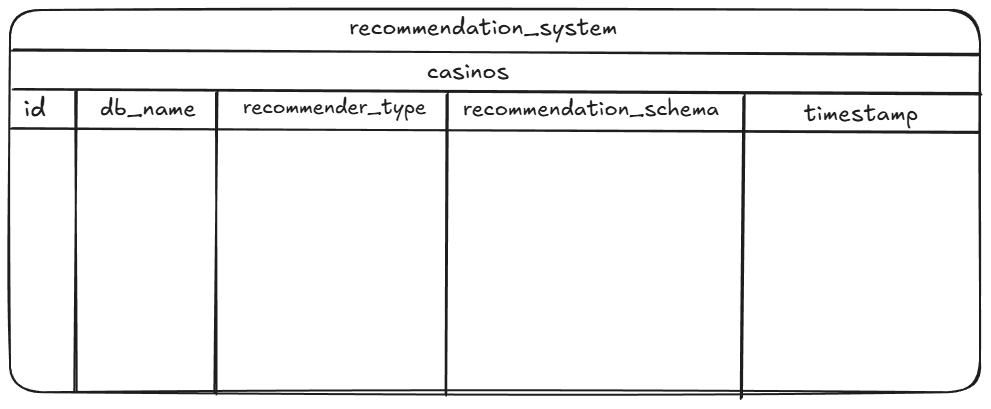

# RecommendationSystem
Assignment for my Systems Programming course

## Technologies Implemented
- Endpoints for schema mapping/renaming and event recommendation
- Multi-Tenant postgresql database architecture
- Strategy pattern with function registry
- Kafka Messaging broker (processing and storing in database)
- Schema Validation
- Testing
  
## Frameworks/Libraries
- Python Flask: for the endpoints
- Marshmallow: for schema validation
- Sqlalchemy: for interacting with database with python
- Confluent_kafka: kafka library for python
- Unittest: for testing

## Prerequisites
- Python 3.x
- pip (Python package manager)
- docker
- docker-compose

## Setup
1. **Clone the repository:**

   ```bash
   git clone https://github.com/PanayiotisPerdios/RecommendationSystem.git
   cd RecommendationSystem
2. **Build containers:**
   ```bash
   docker-compose build
   ```
   to also build dummy producers, use:
   ```bash
   docker-compose --profile dummy build
   ```
3. **Create and Start containers:**
   ```bash
   docker-compose up -d
   ```
   to also up dummy producers, use:
   ```bash
   docker-compose --profile dummy up -d
   ```
    
## Containers/Services used

   ```bash
   recommendation_db #postgres db server
   recommendation_app #main app
   recommendation_kafka #Kafka broker
   recommendation_zookeeper #Kafka manager
   recommendation_kafka_ui #Kafka ui
   recommendation_producer_events #dummy producer for events
   recommendation_producer_coupons #dummy producer for coupons
   recommendation_producer_users #dummy producer for users
   recommendation_consumer_events #consumer for events
   recommendation_consumer_coupons #consumer for coupons
   recommendation_consumer_users #consumer for users
   ```
## Kafka UI
  UI for kafka broker see topics and consumers
   ```bash
   http://localhost:8080/
   ```
## Closing services
1. **Stopping services:**
   ```bash
   docker-compose down
   ```
   to also down the dummy producers, use:
   ```bash
   docker-compose --profile dummy down
   ```
   **Important: once the recommendation_db is down it wipes all data**
   
2. **Wiping services for rebuild**
   ```bash
   docker-compose down --volumes --remove-orphans
   ```
   to also wipe the dummy producers, use:
   ```bash
   docker-compose --profile dummy down --volumes --remove-orphans
   ```

## Testing
1. Enter the container with bash
   ```bash
   docker exec -it recommendation_app bash
   ```
2. To run tests, use:
   ```bash
   coverage run -m unittest discover
   ```
3. To see test coverage percentege, use:
   ```bash
   coverage report
   ```
## Helpful Commands

Enter the master database
   ```bash
   docker exec -it recommendation_db psql -U user -d recommendation_system
   ```
Enter each casinos database (`casino_id` is found in the master database at the `id` field)
   ```bash
   docker exec -it recommendation_db psql -U user -d casino_<casino_id>
   ```

## Project Structure
**Routes/Endpoints:** under `routes.py`
 - **POST /config:** sends a configuration for the recommendations schemas
       
   Example request body:
   ```json
   {
      "recommender_type": "inference",
      "recommendation_schema": {
         "user_id": {"type": "int", "source_field": "id"},
         "bet": {"type": "float", "source_field": "stake"},
         "time": {"type": "float", "source_field": "timestamp"},
         "events": {"type": "list", "source_field": "recommended_events"}
      }
   }
   ```
 - **GET /recommend/{int:user_id}:** returns a recommendation based on the config sent (configuration is required)
       
   Example response body:
   ```json
   {
      "bet": 25.51,
      "events": [
           {
               "away_team": "TEAM6848261046101",
               "country": "BRAZIL",
               "home_team": "TEAM5859262905367",
               "league": "MAJOR LEAGUE SOCCER",
               "odd": 2.69,
               "sport": "FOOTBALL"
           },
           {
               "away_team": "TEAM4842566732191",
               "country": "GERMANY",
               "home_team": "TEAM6848261046101",
               "league": "MAJOR LEAGUE SOCCER",
               "odd": 2.41,
               "sport": "FOOTBALL"
           },
           {
               "away_team": "TEAM6368865321517",
               "country": "AUSTRALIA",
               "home_team": "TEAM7194064693806",
               "league": "MAJOR LEAGUE SOCCER",
               "odd": 2.13,
               "sport": "FOOTBALL"
           }
       ],
       "time": "2025-06-01T11:28:20.507522",
       "user_id": 31
   }
   ```
 - **GET /purchase/{int:user_id}:** creates dummy coupon purchases purely for testing
       
   Example response body:
   ```json
   {
      "coupon_ids": [
        406823,
        487793,
        179162
    ],
    "message": "Coupons created successfully"
   }
   ```
**Business Logic:**

**Algorithmic Structure**:
  
   Under `services.py` four different recommendation algorithms have been implemented and stored in a function registry using the Strategy pattern, allowing seamless usage of each algorithm, algorithms can be set via the `/config` endpoint using the `recommender_type` field
   - `static`: sends the same 3 event recommendation to all users
   - `dynamic`: based on the user's favorite sport field sends recommendation that equal his favorite sport
   - `inference`: it finds the most frequent (sport, league) tuple from the user's previously played coupons and returns events based on it. If the desired number of events isn't met, the remaining events are filled with random choices to ensure results are always returned
     - It's important to note that this algorithm implements a basic caching mechanism using the `UserProfile` SQLAlchemy model which has 3 important fields `favorite_sport_league_json` `purchases_at_last_update` and `last_updated` , the idea behind it is to minimize redundant database queries and avoid recalculating the most frequent (sport, league) tuples every time a recommendation is generated. Instead, the algorithm caches the result in `favorite_sport_league_json`. This cache is used as long as the number of new purchases since the last update (`purchases_at_last_update`) remains below a defined threshold. Once the threshold is passed indicating that enough new data is available to affect the user's preferences, the algorithm recalculates the top pairs and updates the cache accordingly 
   - `inference_score`: it uses a weighted scoring system to rank events and recommend those with the highest scores. The process works as follows:
        - it first retrieves the user's previously played coupons and extracts the top 2 most frequent values for each relevant field: (sport, league, country, home team, and away team)
        - then, for every available event, a score is calculated by comparing the event's attributes against:
             - the user’s favorite sport and country
             - the top 2 most frequent values derived from the user’s past coupon history
        - each field contributes differently to the final score (coupon fields like league or teams may have higher weights than country or sport or user's favorite sport and country)
        - after scoring all events, the list is sorted in descending order of score. The top n events (defined by event_limit) are selected as recommendations
        - if no prior data or matching events exist, the remaining events are filled with random choices to ensure results are always returned
   - `recommendation_generator`: it serves as an interface for generating recommendations in a consistent format, regardless of which algorithm is used
   - `recommender_registry`: used by the `recommendation_generator` to select the appropriate algorithm, implementing the Strategy Pattern

**Database Structure:**

 The database is a Multi-Tenant system, meaning each client/casino has isolated data. The way it works is as follows:
 - a master database called `recommendation_system` acts as a catalog, storing the `casino_id` for all casinos using the schema defined in `db_models_master.py`
   
 - dynamically created casino databases using the function `create_db_per_casino()` each named `casino_<random_int>`, with their own tables defined by `db_models_shared.py`
   
     
**Storing Objects in Database:**

  The functions responsible for storing these objects are: `create_casinos()` `create_user_profile()` `create_users()` `create_teams()` `create_events()` `create_purchased_coupons()`, the process each one follows is outlined below:
  - it serves a unique-id to each dictionary using `generate_unique_id()`
  - checks whether the data is a duplicate or not
  - each dictionary is validated using its corresponding schema from `schemas.py`
  - the data is then mapped to an SQLAlchemy object using either `db_models_shared.py` or `db_models_master.py`, and stored in the database
  - it’s important to note that in a Multi-Tenant system, we must maintain the correct database session or context at all times to determine which database to store our data in, this is why we use the `get_casino_db_session()` under `utils.py`

**Kafka broker:**

There three files that serve different purpuses `init_topics.py` `consumer.py` and `producer.py`
  - three topics are initialized `events` `coupons` `users` by `init_topics.py` through the `create_topics()` function. This initialization happens at app startup, as `run.py` calls `create_topics()`
  - after the `recommendation_app` and `recommendation_kafka` are intialized and their conditions are healthy the 3 consumers start up from `consumer.py`, `recommendation_consumer_coupons` `recommendation_consumer_users`     
  `recommendation_consumer_events`
  - optionaly using the flag `--profile dummy` would result in the initialazation of the 3 dummy producers `recommendation_producer_users` `recommendation_producer_events` `recommendation_producer_coupons` which are used to send dummy messages to   test the consumers
    
  Once the consumers receive messages, they invoke three functions `create_events()` `create_purchased_coupons()` `create_users()` each corresponding to a topic queue. As previously mentioned, these functions check for duplicates and incomplete     or low-quality data, rejecting any that don't meet the criteria. Valid entries are then validated and saved to the appropriate casino database

**Configuration:**

The configuration for the database and kafka broker along with some static dummy data are located under `config.py`
    
**Dummy Data:**

The initialization of dummy data occurs at the start of the app's execution (`run.py`) with the function `populate_db()` under `services.py` using functions to generate dummy dictionary data such as `generate_dummy_users()` `generate_dummy_casinos()` `generate_dummy_events()` `generate_dummy_teams()`

## Complete Architecture


       
